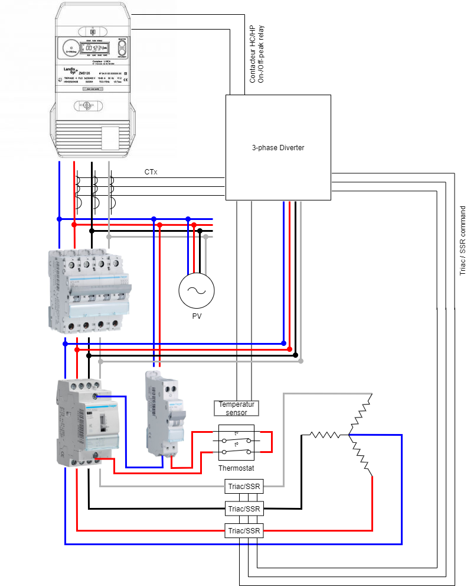
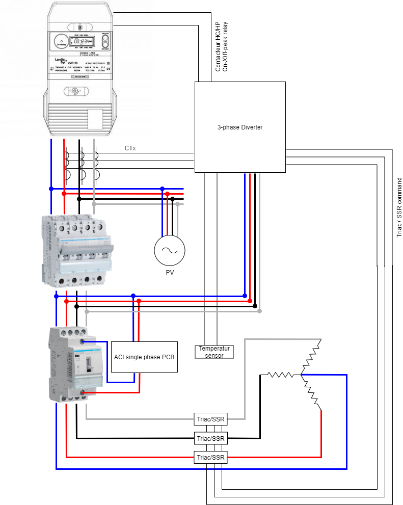
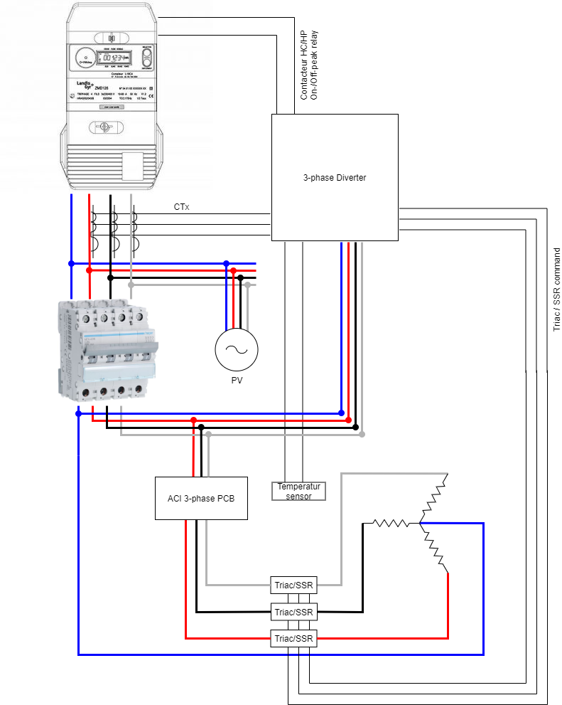
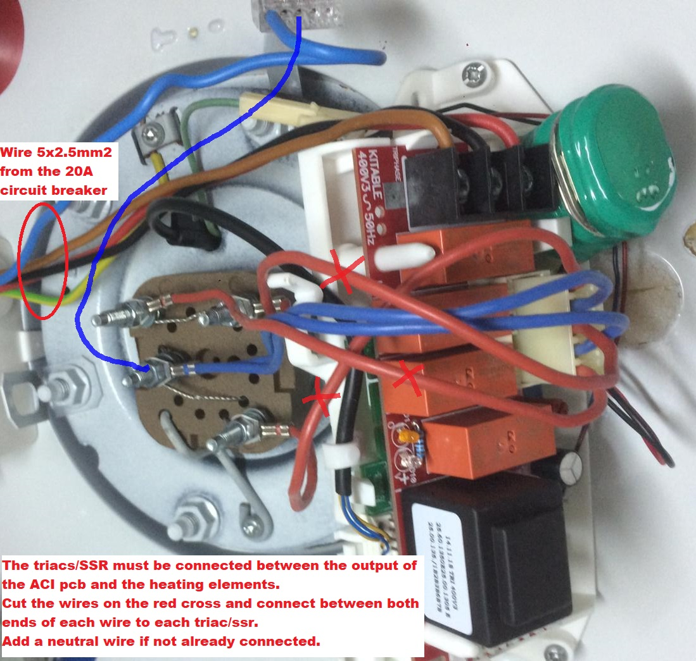
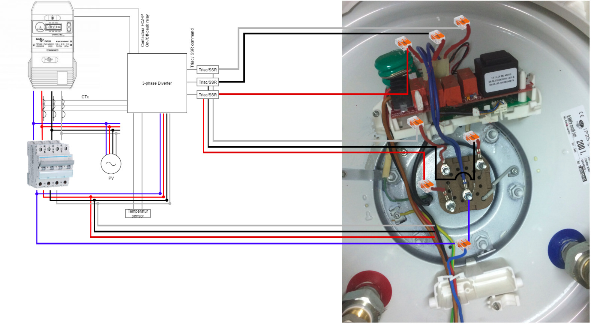

  English |
  <a href="lang/fr-fr/">Français</a>

# PVRouter (3-phase version)

My version of the 3-phase Mk2PVRouter firmware (see <http://www.mk2pvrouter.co.uk>).

Robin Emley already proposes a 3 phase PV-router (<https://www.mk2pvrouter.co.uk/3-phase-version.html>).
It supports 3 resistive output loads, which are completely independent.

---
**_NOTE:_**

For a single phase version, please see [PVRouter-Single](https://github.com/FredM67/PVRouter-Single).

---

- [PVRouter (3-phase version)](#pvrouter-3-phase-version)
  - [Implementation documentation](#implementation-documentation)
  - [End-user documentation](#end-user-documentation)
    - [Overview](#overview)
    - [Load priorities management](#load-priorities-management)
    - [Off-peak period detection](#off-peak-period-detection)
    - [Force full power](#force-full-power)
    - [Temperature sensor](#temperature-sensor)
  - [Wiring diagram](#wiring-diagram)
    - [Requirements](#requirements)
    - [Heater with mechanical thermostat](#heater-with-mechanical-thermostat)
    - [Heater with ACI single phase thermostat](#heater-with-aci-single-phase-thermostat)
    - [Heater with ACI 3-phase thermostat](#heater-with-aci-3-phase-thermostat)

## Implementation documentation

You can start reading the documentation here [3-phase diverter](https://fredm67.github.io/PVRouter-3-phase/html/index.html).

## End-user documentation

### Overview

Goal was to modify/optimize the sketch for the "special" case of a 3-phase water heater. A 3-phase water heater is composed in fact of 3 independent heating elements. Most of the time, such a heater can be connected in mono, or 3-phase WYE or 3-phase Delta.
When connected in WYE (without varistor), there's no need of a neutral wire because the system is equally distributed, so at any time, there's no current flowing to the neutral.

If a diverter is used, the neutral wire must be connected.

Added functionalities:

- load priorities management (configurable)
- off-peak period detection (configurable)
- force full power
- temperature sensor (just reading for the moment)
- optimized (RF) data logging
- serial output in JSON or TXT

The original sketch had to be completely re-worked and re-structured to support temperature reading. In the original sketch, the ISR "just" reads and converts the analog data, and the processing is done in the loop. This won't work with a temperature sensor because of its slow performance. It would break the whole system, current/voltage data will be lost, ...

Now, all the time-critical processing is done inside the ISR, other stuff like (RF) data logging, Serial printing, temperature reading is made inside the loop(). The ISR and main processor communicate with each other through "events".

### Load priorities management

In my variant of Robin's sketch, the 3 loads are still physically independent, so it means, the router will divert surplus of energy to the first load (highest priority) from 0% to 100%, then to the second (0% to 100%) and finally to the third.

To avoid that the priorities stays all the time unchanged, which would mean that load 1 will run much more than load 2, which again will run much more than 3, I've added a priority management.
Each day, the load priorities are rotated, so over many days, all the heating elements will run somehow the same amount of time.

### Off-peak period detection

Depending on the country, some energy meters provide a switch which toggles on at the beginning of the off-peak period. It is intended to control a relay. If you wire it to a free digital pin of the router (in my case D3), you can detect off-peak/peak period.

### Force full power

Support has been added to force full power on specific loads. Each load can be forced independently from each other, start time and duration can be set individually.

In my variant, that's used to switch the heater one during off-peak period if not enough surplus has been routed during the day. Here, to optimize the behavior, a temp-sensor will be used to check the temperature of the water and decide to switch on or not during night.

### Temperature sensor

For the moment, just reading. It'll be used to optimize force full power, to make the right decision during night.

## Wiring diagram

### Requirements

Your water heater MUST support 3-phase wiring (i.e. it must have 3 heating elements).

---
**_Safety Warning_**
To modify the existing wiring, access to 240V mains voltage is required. Please take great care, and do not undertake this stage unless you feel confident to do so.

---

### Heater with mechanical thermostat

Since on all (3-phase) water heaters I've seen, the thermostat switches only 2 phases in normal mode (all 3 phases in security mode), it must be wired in another way to achieve a full switch on all 3 phases. In a fully balanced 3-phase situation, you don't need any neutral wire. To switch off the device, you only need to switch off 2 phases.

For that, I've "recycled" a peak/off peak 3-phase relay but you can use any 3-phase relay. It doesn't matter on which phase the command coil is connected, but it must be permanent (not through the router).

*Figure: Wiring diagram*

### Heater with ACI single phase thermostat

In this case, it's somehow the same situation as before.
You don't need to buy a 3-phase kit to convert your single phase heater.
The ACI pcb must be connected to a permanent phase. It will then control any 3-phase relay.

*Figure: Wiring diagram*

### Heater with ACI 3-phase thermostat

In this case, the neutral wire is not connected to the ACI pcb. So you'll need to connect the neutral wire to the blue wire already connected to the heating elements. The ACI pcb must be connected to 3 permanent phases.

*Figure: Wiring diagram*

*Figure: An ACI 3-phase module*

And now with an "hybrid" schematic-picture:

*Figure: How to connect ACI 3-phase module*
